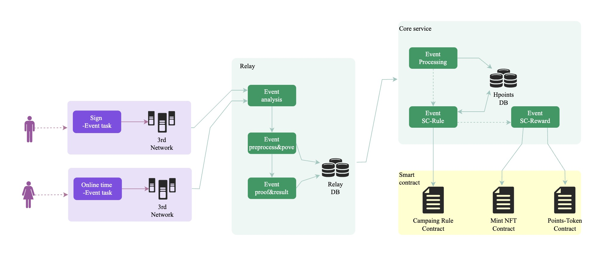

# ischia
> This doc is still working in progress

Ischia is an incentive points platform that enables project parties to build their own incentive applications for points ecosystem on Ischia DAPP. Projects can post user growth tasks through the Ischia platform to gain user growth. At the same time, Ischia functional components can be used to customize the application scenarios of various marketing activities. Ischia is also a reputation system, where users can increase reputation scores through on-chain transaction data or social bonding. reputation can be applied in kyc, airdrop, Credit and other scenarios. Ischia is a one-stop marketing platform.

## repository
This repository is the set of resources that are used for Project Ischia. It contains code, deployment scripts, documents, and tests necessary .

## Architecture diagram

- Relay: Collects procedural data generated by participants during certain tasks to determine if they have completed the task and to generate proof.
- Core Service: Validates the results of the tasks performed by participants and distributes points according to the rules set by the project organizers.
- Smart Contract: Responsible for the exchange of rewards.

## Contributing

We welcome all contributions! There are many ways to contribute to the project, including but not limited to:

- Cloning code repo and opening a [PR](https://github.com/hetu-project/ischia/pulls).
- Submitting feature requests or [bugs](https://github.com/hetu-project/ischia/issues).
- Improving our product or contribution [documentation](./docs/).
- Contributing [use cases](./demos/) to a feature request.
